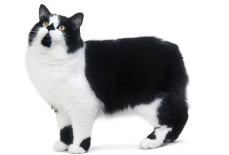
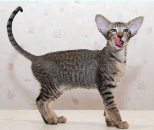
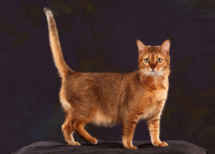
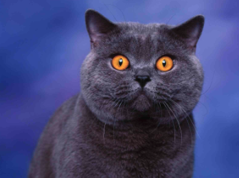
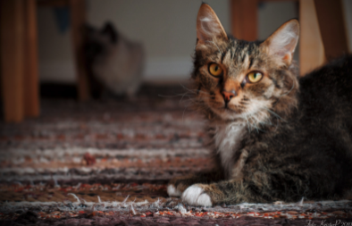
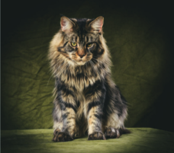

# phase-1-project-1

**Installation:**
None required

**Description:**
This program will allow the user to search information on a list of cat breeds from the https://thecatapi.com/. 

Searching a cat breed from the available list will provide the following information: example image, affection level, energy level, if hairless or not, intelligence level, life span, weight range, temperament, and general description. If a breed not in the list is entered, the form will display 'BREED NOT FOUND' for 3 seconds.

Clicking the favorite button will save the cats image and name in the favorites bar allowing the user to remember the cat breed while searching for information on more breeds. Up to three breeds can be favorited at once and one breed cannot be on the favorites list twice. Favoriting a breed already on the favorites list will alert the user 'ALREADY IN FAVORITES'. 

Once a cat breed is "chosen", the user can enter the cat breed in the form at the bottom and give the cat any name. Clicking the "Choose!" button will alert the user with congratulations message.

**Roadmap:**
The final stages of the application could be extended to more of a meaningful end result. Instead of just an alert, it could actually adopt a pet. Also, currently this is limited to 67 breeds that the public cat api provides. Extending this to more breeds would allow for a better selection and use of the features of the application.

**Authors:**
Brian Perez